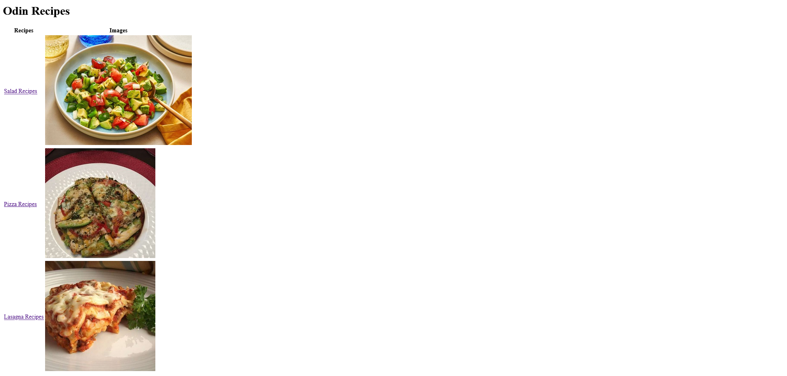

# 🍽️ Odin Recipes | 🌐 Landing Page | 🧮 Calculator  
## A Collection of Projects from [The Odin Project](https://www.theodinproject.com/)

Welcome to my **Odin Foundations Course** project collection! This repository contains three beginner-friendly web development projects that helped me build strong skills in **HTML**, **CSS**, and **JavaScript**.

Here's what you'll find inside:


## 📁 Projects Overview

### 1. **Odin Recipes** 🥘  
A simple HTML-based website showcasing a few recipes with descriptions, ingredients, and preparation steps.

🔗 Features:
- Main index page linking to multiple recipe pages
- Proper HTML structure using semantic tags
- Lists (unordered & ordered) for ingredients and steps
- Images and links for better navigation

📁 Folder: `/recipes`


### 2. **Landing Page** 🎯  
A static HTML/CSS page built based on a provided design mockup.

🎨 Features:
- Clean layout using **Flexbox**
- Hero section with call-to-action
- Multiple content sections
- Responsive desktop-first design
- Custom fonts and colors

📁 Folder: `/landing-page`


### 3. **Calculator** ➕➖✖➗  
A fully functional calculator made with HTML, CSS, and JavaScript — without using `eval()`!

🧮 Features:
- All basic math operations: addition, subtraction, multiplication, division
- Clear button to reset calculations
- Error handling for invalid inputs (like dividing by zero)
- Optional extras: decimal support, keyboard input

📁 Folder: `/calculator`


## 💾 Commit Best Practices

I followed clean commit messages like:
- `feat(recipes): add lasagna recipe page`
- `fix(calculator): handle divide by zero error`
- `refactor(landing): improve flexbox alignment`


## 📷 Screenshots

Here are some previews of what each project looks like when completed:

| Project        | Preview |
|:----------------|:---------:|
| **Odin Recipes** |  |
| **Landing Page** |  |
| **Calculator**   |  |


## 📦 Repository Structure

```
odin-projects/
│
├── README.md
│
├── screenshots/               <-- 📸 All screenshots go here (for future use)
│   ├── recipes.png
│   ├── landing-page.png
│   └── calculator.png
│
├── recipes/
│   ├── index.html             <-- Main homepage linking to all recipes
│   ├── images/                <-- 🖼️ Recipe images for lasagna, pizza, salad
│   │   ├── lasagna.jpg
│   │   ├── pizza.jpg
│   │   └── salad.jpg
│   └── recipes/               <-- 📄 Individual HTML files for each recipe
│       ├── lasagna.html
│       ├── pizza.html
│       └── salad.html
│
├── landing-page/
│   ├── index.html             <-- 🏠 Landing page HTML
│   ├── style.css              <-- 💅 Styling for the landing page
│   └── images/                <-- 🖼️ Images used in the landing page design
│       ├── hero-image.jpg
│       └── feature-icon.png
│
└── calculator/
    ├── index.html             <-- 🔢 Calculator UI (buttons, display)
    ├── style.css              <-- 💅 Styling for the calculator
    ├── script.js              <-- 🧠 JavaScript logic for calculator operations
    └── images/                <-- 🖼️ Optional: any icons or backgrounds
        └── calculator-bg.png
```


## 🙏 Acknowledgments

Thanks to [The Odin Project](https://www.theodinproject.com/) for this amazing free curriculum!


## 👨‍💻 Connect With Me

If you have questions or want to collaborate:
- 🐱[GitHub](https://github.com/onyxwizard)
- 📧[Daily Dev](https://app.daily.dev/onyxwizard)
- 💬 Discord: Join the Odin Project Community


## 📝 License

MIT License – feel free to use this as inspiration for your own portfolio or learning purposes.


🎉 **Happy coding and enjoy exploring the projects!** 🔥